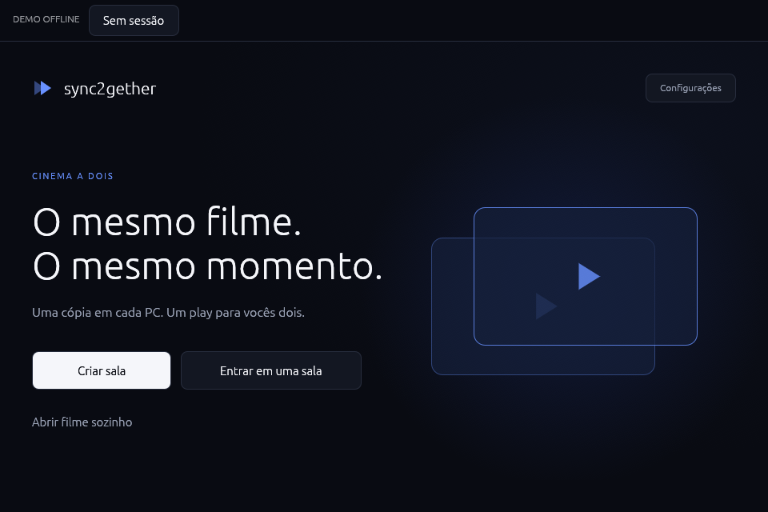
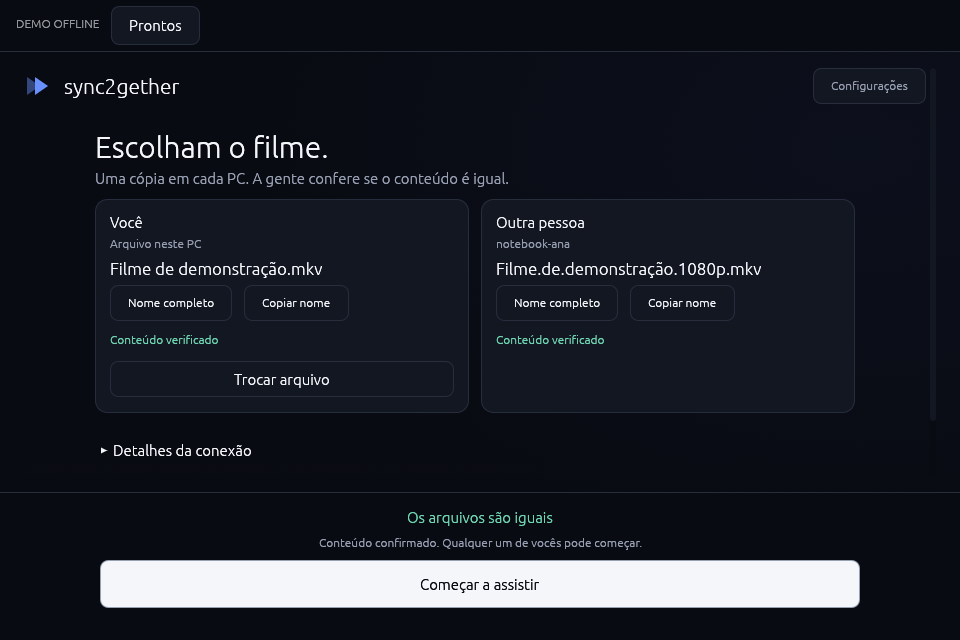
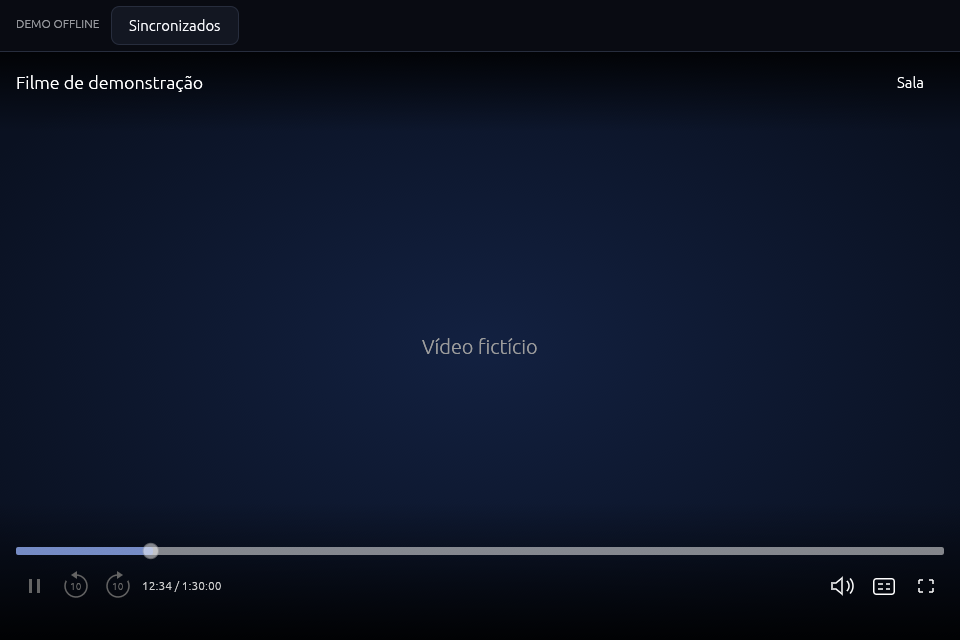
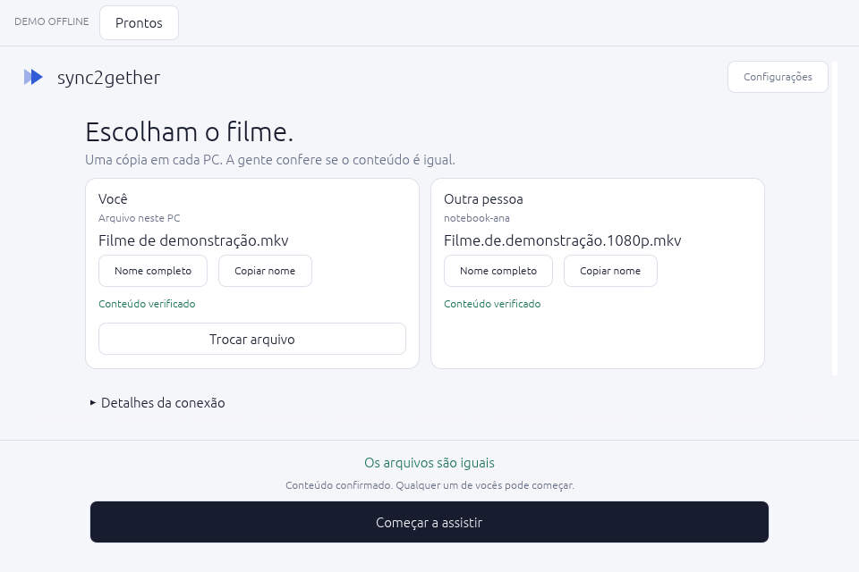

# sync2gether

Assista ao mesmo filme com outra pessoa, à distância. Uma cópia local em cada
PC, com play, pause e posição de reprodução sincronizados pela rede local ou VPN.

[Baixar](https://github.com/8bury/sync2gether/releases) ·
[Instalar](#instalação) · [Como funciona](#como-funciona) ·
[Screenshots](#screenshots) · [Desenvolver](#desenvolvimento)



*Captura do modo demo offline, com dados fictícios. As imagens desta página
mostram a interface; não demonstram reprodução ou sincronização real.*

## Como funciona

O sync2gether é um aplicativo de desktop para duas pessoas. Cada PC reproduz
seu próprio arquivo com libmpv. A conexão envia comandos e informações de
sincronização, sem transmitir o vídeo e sem precisar de um servidor externo
do aplicativo.

1. Uma pessoa cria a sala e a outra solicita entrada pela lista da rede ou por `IP:porta`.
2. O anfitrião aprova a entrada. Cada pessoa escolhe sua cópia do filme.
3. O app verifica o conteúdo dos dois arquivos. Quando ambos estão prontos,
   qualquer participante pode clicar em **Começar a assistir**.
4. Play, pause e mudanças de posição acompanham os dois players. Volume,
   áudio e legendas são ajustados separadamente em cada PC.

O MVP inclui descoberta de salas, aprovação de entrada, verificação dos
arquivos, início agendado, correção de desvio e reconexão automática do convidado.
Também é possível abrir um filme sozinho.

## Instalação

Baixe o pacote para sua distribuição e o arquivo `SHA256SUMS` em
[Releases](https://github.com/8bury/sync2gether/releases). A versão 0.1.0 tem
pacotes para **Arch Linux atualizado** e **Ubuntu 24.04**, ambos em x86_64.

### Arch Linux

```sh
sudo pacman -U ./sync2gether-0.1.0-1-x86_64.pkg.tar.zst
```

### Ubuntu 24.04

```sh
sudo apt install ./sync2gether_0.1.0_amd64.deb
```

Os gerenciadores instalam as dependências, incluindo libmpv. Abra
**sync2gether** pelo menu de aplicativos ou execute `sync2gether` no terminal.
O seletor de arquivos usa o portal do desktop; em ambientes mínimos, configure
um backend como `xdg-desktop-portal-gtk` ou `xdg-desktop-portal-kde`.

Para conferir os arquivos baixados, execute na pasta dos pacotes:

```sh
sha256sum --ignore-missing -c SHA256SUMS
```

O pacote Ubuntu não é compatível com 22.04. O pacote Arch requer as bibliotecas
de um sistema atualizado. Os binários de release não incluem o modo demo.

## Screenshots

Todas as capturas abaixo usam os cenários fictícios do modo demo offline.

### Escolham o filme

Os dois participantes veem os arquivos escolhidos e o resultado da comparação
de conteúdo antes de começar.



### Assistam juntos

O player reúne a linha do tempo, play/pause, saltos de 10 segundos, volume,
faixas de áudio, legendas e tela cheia. O botão **Sala** abre os detalhes da sessão.



<details>
<summary>Ver a preparação no tema claro</summary>

O tema claro fica disponível em **Configurações**.



</details>

## Antes da sessão

- Os arquivos precisam ter o mesmo conteúdo completo. O app compara tamanho e
  hash BLAKE3; nomes diferentes são aceitos, mas remuxes e alterações de
  metadados podem tornar os arquivos incompatíveis. A verificação ocorre em
  segundo plano e pode levar algum tempo em arquivos grandes.
- Os PCs precisam conseguir se comunicar por TCP. A porta padrão da sala é
  `7842`; a descoberta usa UDP `7841`, com multicast e broadcast IPv4.
  Configure o firewall para permitir esse tráfego.
- A descoberta depende da rede ou VPN. Se a sala não aparecer, use
  **Conectar por endereço**. O app não instala nem configura uma VPN.
- Uma desconexão, falha do player ou fim do filme pausa a sessão. Após a
  reconexão, os players recuperam a posição do anfitrião e aguardam um novo play.
  Fechar o anfitrião encerra a sala.

Veja o [guia de uso](docs/uso.md) para conexão manual, troca de arquivos,
controles e atalhos. Chamadas de voz podem acontecer em um aplicativo separado.

## Desenvolvimento

A stack usa Rust, egui/eframe com OpenGL, Tokio, Serde e libmpv.
O arquivo `rust-toolchain.toml` fixa a versão do Rust.

Depois de instalar as [dependências de desenvolvimento](docs/desenvolvimento.md#ambiente-de-desenvolvimento):

```sh
cargo run --locked
```

Para explorar a interface com dados fictícios, sem carregar filmes ou abrir sockets:

```sh
cargo run --locked --features demo -- --demo --demo-state ready
```

As verificações do projeto rodam com:

```sh
bash scripts/check.sh
```

| Guia | Conteúdo |
| --- | --- |
| [Uso](docs/uso.md) | Salas, rede, arquivos, controles e atalhos |
| [Desenvolvimento e testes](docs/desenvolvimento.md) | Dependências, demo, capturas e testes com vídeo sintético |
| [Arquitetura e sincronização](docs/arquitetura.md) | Módulos, libmpv, protocolo e correção de desvio |
| [Diagnóstico](docs/diagnostico.md) | Logs, GDB e travamentos em Wayland |
| [Pacotes Linux](docs/empacotamento.md) | Builds com Docker e GitHub Actions |
| [Histórico de validação](docs/validacao.md) | Ambientes e cenários testados nas revisões anteriores |
| [Notas da versão 0.1.0](docs/releases/v0.1.0.md) | Pacotes, validação e limites da release |

As instruções para agentes estão em [AGENTS.md](AGENTS.md).

## Validação e limites

Os pacotes 0.1.0 foram compilados, instalados e exercitados em containers Arch
e Ubuntu 24.04. Os testes usaram TCP em localhost, dois players libmpv com vídeo
sintético, atraso e jitter de rede, áudio virtual e OpenGL com Xvfb/Mesa por
software. A interface também foi revisada em CachyOS com Wayland/Hyprland.

Esses cenários não comprovam sincronização entre dois PCs físicos, saída física
de áudio, descoberta por uma VPN real ou desempenho em GPUs diferentes.
Filmes longos, HDR e fidelidade de cores precisam de validação adicional.
Consulte os [detalhes da validação da release](docs/releases/v0.1.0.md#validação-e-limites).
